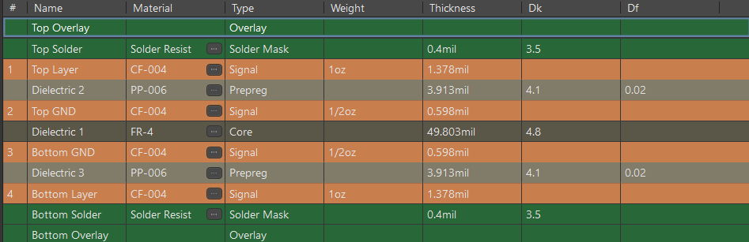
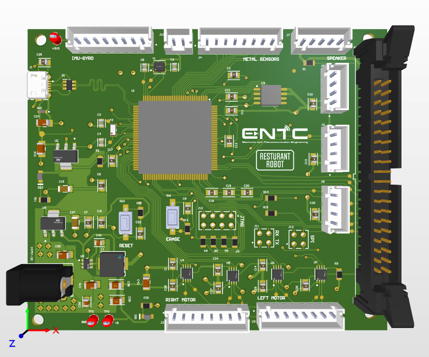
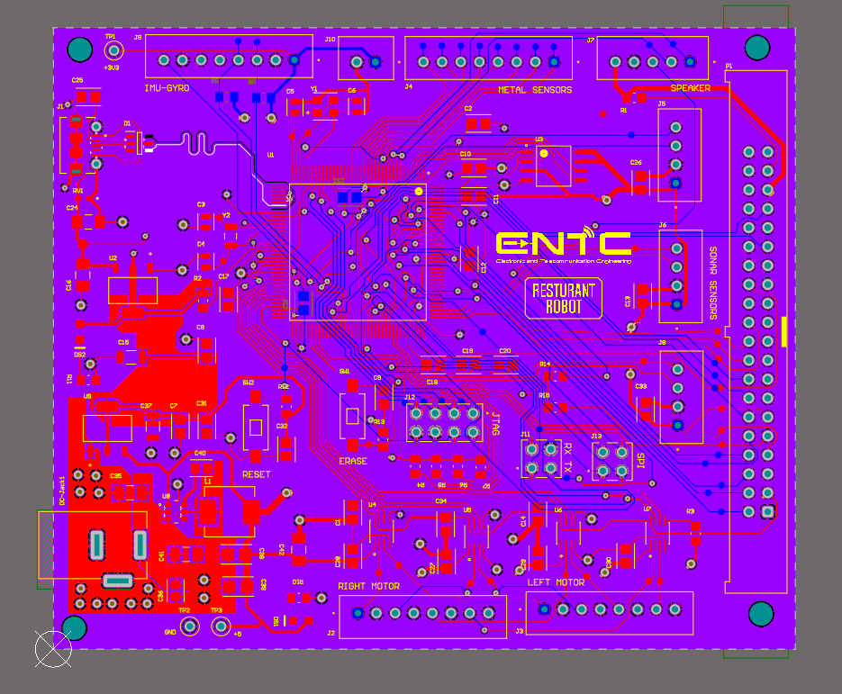

# Restaurant Service Robot

This project is a service robot designed for indoor restaurant environments. It automates food delivery and customer interaction using smart sensors, efficient path planning, and a modular hardware platform.

> 🏫 University of Moratuwa — Department of Electronic & Telecommunication Engineering  
> 📘 Course: EN2160 - Electronic Design Realization  
> 🗓 May 2025

---

## 📦 Project Summary

The Restaurant Robot was developed to ease the workload of restaurant staff by autonomously delivering food and engaging with customers. It integrates motion control, obstacle detection, a voice feedback system, and a touch display to provide a smooth and interactive service experience.

---

## 🔧 Key Features

- *Autonomous Navigation*: Uses metal-detecting sensors and ultrasonic modules to follow predefined paths and avoid obstacles.
- *Voice Interaction*: MAX98357A-based sound system for audio prompts and status feedback.
- *User Display*: 7” TFT LCD with SSD1963 controller to show order status, welcome messages, etc.
- *Reliable Power*: Powered by a replaceable battery system designed for 12–24 hours of continuous use.
- *Modular Architecture*: RS-485-based communication allows distributed control and easy upgrades.
- *Microcontroller*: SAM3X8E ARM Cortex-M3 handles all control tasks efficiently.

---

## 🧩 PCB Design

The system is implemented on a compact 4-layer PCB to support noise-sensitive signals and high-current paths. The design emphasizes power and signal integrity while keeping the layout compact for integration into the robot chassis.

- *Top & Bottom Layers*: Signal routing  
- *Inner Layers*: Dedicated Ground and Power planes  
- *Key Considerations*:
  - Wide polygon pours for power
  - Matched-length routing for differential pairs
  - Test points for debugging and maintenance
  - Modular breakouts for sensors and displays

---

## 🖼 PCB Visuals

| Layer Stackup | 3D PCB View | 2D PCB Layout |
|---------------|-------------|----------------|
|  |  |  |

> 📝 The PCB height and layout were optimized to accommodate onboard regulators, high-power traces, and external motor drivers.

---

## 👨‍💻 Contributors

- Arachchi M.B.F  
- Bandara I.W.T.N 
- Boralugoda M.S 
- Karunathilake K.D.K  
- Peiris P.I.U 
- Sanjeewa P.M.G.P.N 
- Senaweera S.A.H.D  
- Viduranga J.K.A  
- Wijayarathna K.K.B.C  
- Wijenayaka M.B.T.I 

---

## 📄 License

This project is provided for academic and research purposes only. Please attribute credit if reused or modified.
