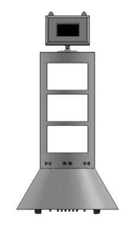
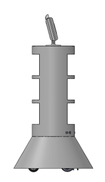
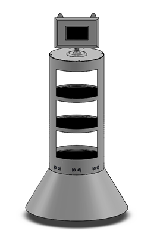
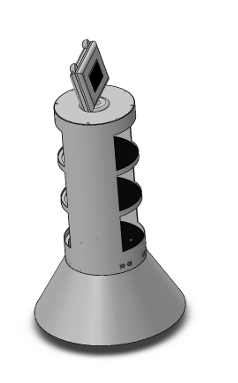
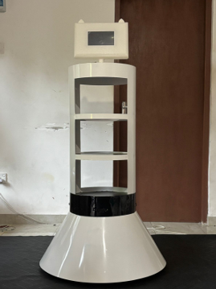
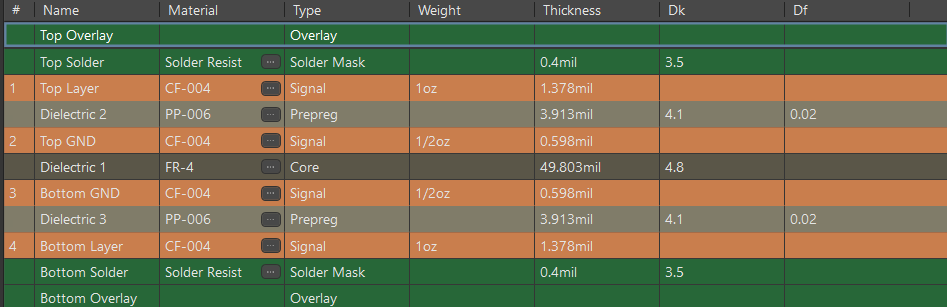
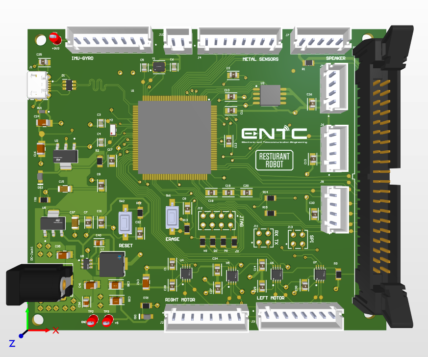
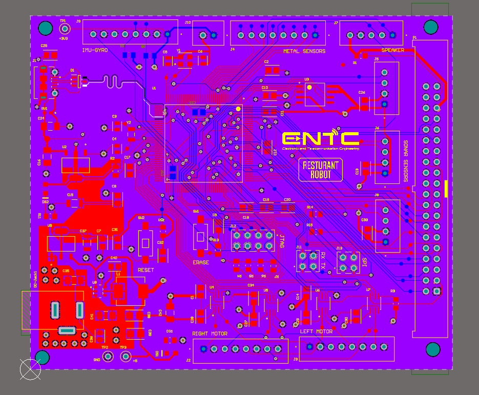

# 🤖 Evora: The Restaurant Service Robot

Evora is a modular, intelligent restaurant robot designed to enhance customer service by autonomously navigating dining areas, delivering food, interacting with guests, and providing real-time feedback. Inspired by commercial systems like BellaBot, Evora integrates mobility, interactive communication, and advanced control systems into a robust, compact design.

---

## 📦 Project Overview

Evora combines a SAM3X8E microcontroller-powered brain with reliable sensor arrays, display and audio feedback systems, and a solid mechanical frame. The subsystems are interconnected via a full-duplex RS-485 communication bus for high-speed, noise-immune data exchange.

---

## 🚀 Key Features

### 🧠 Intelligent Navigation
- **Sensors**: Equipped with **OMRON E2E inductive proximity sensors** and **A02 object avoidance modules**.
- **Capabilities**: Autonomous routing, dynamic obstacle avoidance, and safe maneuvering in busy dining environments.

### 📺 Interactive Display System
- **Display**: 7.0” TFT LCD with SSD1963 controller.
- **Function**: Displays digital menus, navigation instructions, and order confirmations.

### 🔊 Voice Feedback
- **Audio Chain**: MAX98357A DAC → Winbond W25Q128JV flash → AS041008C speaker.
- **Purpose**: Provides voice prompts and responses for improved user interaction.

### 🍽️ Tray Delivery Mechanism
- **Design**: Multi-tray system, each tray supports up to **10 kg**.
- **Engineering**: Balance and safety optimized; FEA confirms up to **265 N** load with **SF = 2**.

### 🛜 RS-232 Communication Bus
- **Architecture**: Full-duplex, multi-node capable.
- **Benefits**: Real-time communication, high noise immunity, scalable subsystem integration.

### 🔋 Power System
- **Battery**: Replaceable power unit supports **12–24 hours** operation.
- **Recharge Time**: ~4.5 hours for full cycle.

### 🛡️ Safety & Hygiene
- Emergency stop button.
- Collision detection.
- Food-safe materials and build quality.

### 🧱 Modular and Scalable
- Subsystems are modular for **easy upgrades**, **repair**, and **customization**.
- Adaptable to various restaurant layouts and service models.

---

## 🖼️ Robot Preview

## 🖼️ Working Product
  

## 🧩 PCB Design

The system is implemented on a compact 4-layer PCB to support noise-sensitive signals and high-current paths. The design emphasizes power and signal integrity while keeping the layout compact for integration into the robot chassis.

- *Top & Bottom Layers*: Signal routing  
- *Inner Layers*: Dedicated Ground and Power planes  
- *Key Considerations*:
  - Wide polygon pours for power
  - Matched-length routing for differential pairs
  - Test points for debugging and maintenance
  - Modular breakouts for sensors and displays

---

## 🖼 PCB Visuals

| Layer Stackup | 3D PCB View | 2D PCB Layout |
|---------------|-------------|----------------|
|  |  |  |

> 📝 The PCB height and layout were optimized to accommodate onboard regulators, high-power traces, and external motor drivers.
